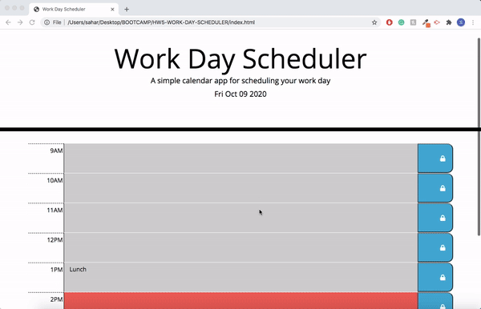
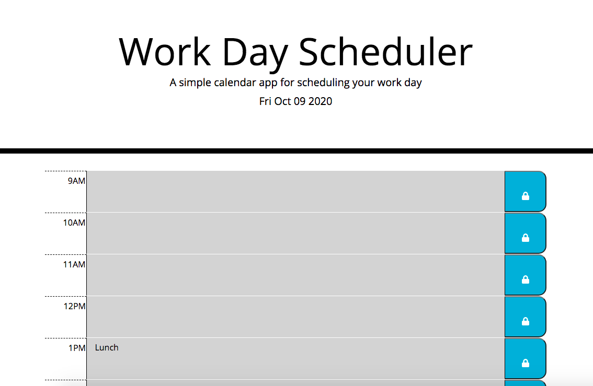
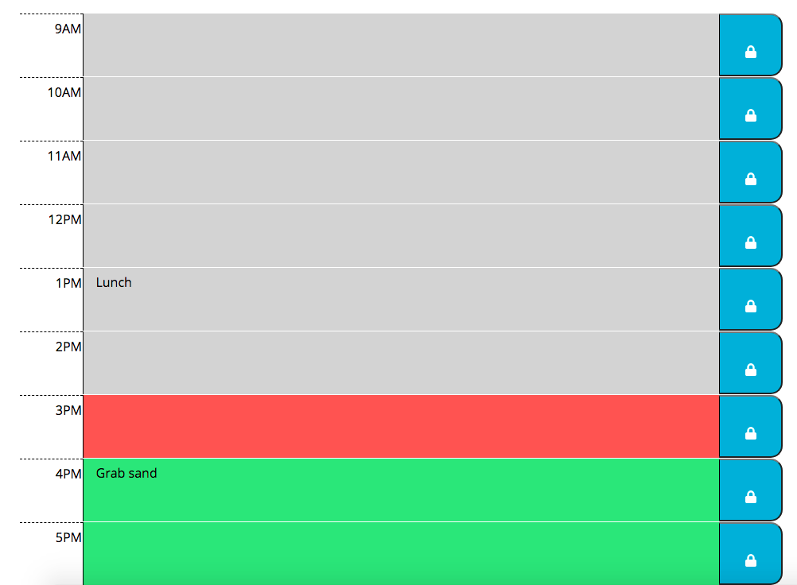

# Work Day Scheduler

This Workday Scheduler helps log activities for every hour from 9AM through 5PM. The hours are dynamically color-coded, with past hours in grey, current hour in red and future hours in green. Using local stoarage, the user can log a task by clicking in the lock button. Working on this assignment helped me understand JSON parsing and stringifying and why it is necessary to employ the JSON methods. I also gained a deeper understanding of jQuery element manipulation and am really comfortable using it.

## HW repository

https://github.com/saharVac/work-day-scheduler

## Deployed version of the app

https://saharvac.github.io/work-day-scheduler

## Running the application

Page is easily navigable, refer to the following gif and screenshot:

## Website used

I mostly referred back to jQuery documentation site:
https://api.jquery.com/
